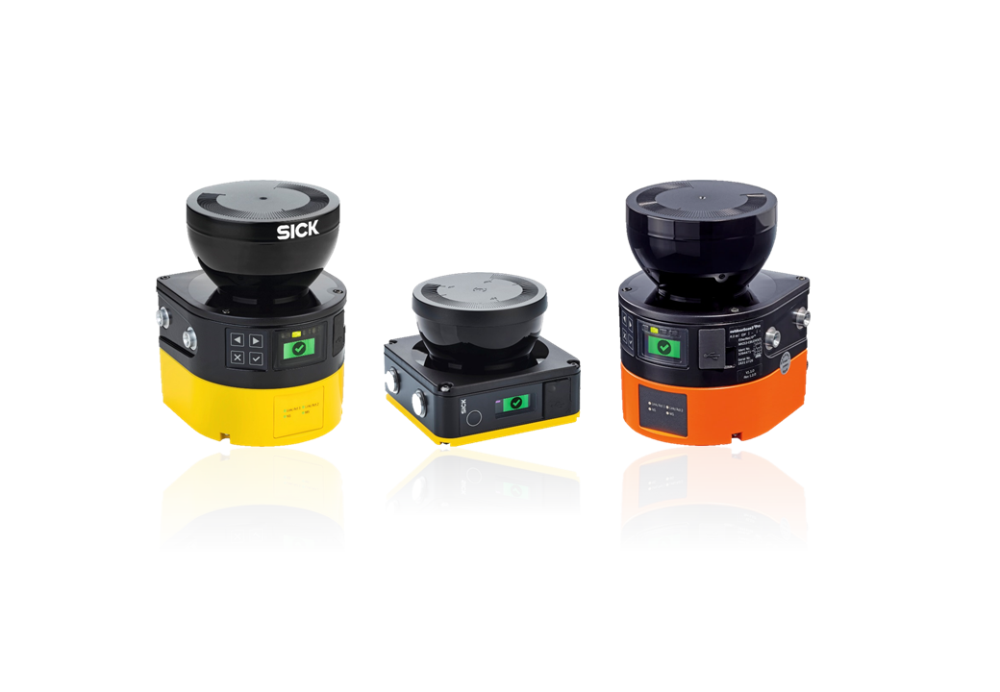

# Sick_Safetyscanners ROS Driver

## Table of contents

- [Supported Hardware](#supported-hardware)
- [Getting started](#getting-started)
- [ROS API](#ros-api)
- [Creators](#creators)

A ROS Driver which reads the raw data from the SICK Safety Scanners and publishes the data as a laser_scan msg.

## Supported Hardware

Supported are all microScan3, nanoScan3 and outdoorScan3 variants with Ethernet connection.




## Getting started

The ROS driver will be released as a debian package, and therefore can be installed from binaries or from source.

### Prerequisites

* Linux
* Working ROS-Distro
* Correctly setup SICK Safety Scanner
* Connected SICK Safety Scanner and a correctly setup ethernet network. Both the host and the sensor have to be in the same network.

### Installation

In the following instructions, replace `<rosdistro>` with the name of your ROS distro (e.g., `kinetic`).

#### From Binaries

The driver is released at longer intervals as a binary package. 

`sudo apt-get install ros-<rosdistro>-sick_safetyscanners`


#### From Source

```bash
source /opt/ros/<rosdistro>/setup.bash
mkdir -p ~/catkin_ws/src/
cd ~/catkin_ws/src/
git clone https://github.com/SICKAG/sick_safetyscanners.git
cd ..
catkin_make install
source ~/catkin_ws/install/setup.bash
```

### Starting

To start the driver the launch file has to be started. For the driver to work correctly, the sensor ip and host ip have to be defined. These parameters can be passed to the sensor as arguments via launch file.

```
roslaunch sick_safetyscanners sick_safetyscanners.launch sensor_ip:=192.168.1.10 host_ip:=192.168.1.9
```

This will start the driver and the dynamic reconfigure node. In this you can set different parameters on runtime, especially the angles and the data the sensor should publish. If these parameters should be set on startup they can be loaded to the parameter server beforehand.

To visualize the data start rviz and subscribe to the ~/laser_scan topic.

```
rosrun rviz rviz 
```

### Troubleshooting

* Check if the sensor has power and is connected to the host.
* Check if both sensor and host are in the same subnet e.g. 192.168.1
* Check if the launch file is called with the correct parameters for IP-addresses and ports.

## ROS API


### Advertised ROS Topics


`
~/laser_scan (type: sensor_msgs/LaserScan)
`

Publishes a scan from the laserscanner

`
~/extended_laser_scan (type: sick_safetyscanners/ExtendedLaserScanMsg)
`

Extends the basic laser scan message by reflector data and intrusion data.

`
~/output_paths (type: sick_safetyscanners/OutputPathMsg)
`

Gives feedback of the current status of the output paths.


`
~/raw_data (type: sick_safetyscanners/RawMicroScanDataMsg)
`

Publishes the raw data from the sensor as a ROS message.

`
~/diagnostics (type: diagnostic_msgs/DiagnosticArray)
`

Frequency and timestamp diagnostics information.

### Advertised ROS Services

`
~/field_data
`

Returns all configured protective and warning fields for the sensor


### ROS parameters

| Parameter Name        | Type | Default |Required on startup | Information |
| -------------                   |  ------|------- | ------------| ------------- |
| sensor_ip                    | String | 192.168.1.11 | ✔ |Sensor IP address. Can be passed as an argument to the launch file. |
| host_ip                        |   String  | 192.168.1.9 | ✔ | Host IP address.  Can be passed as an argument to the launch file.  |
| host_udp_port             | Integer | 0 | | Host UDP Port.  Can be passed as an argument to the launch file.  Zero allows system chosen port. |
| frame_id  | String | scan | | The frame name of the sensor message  |
| skip    | Integer | 0 | | The number of scans to skip between each measured scan.  For a 25Hz laser, setting 'skip' to 0 makes it publish at 25Hz, 'skip' to 1 makes it publish at 12.5Hz. |
| angle_start              | Double |  0.0| | Start angle of scan in radians, if both start and end angle are equal, all angels are regarded.  0° is at the front of the scanner. |
| angle_end                | Double | 0.0 | | End angle of scan in radians, if both start and end angle are equal, all angels are regarded.  0° is at the front of the scanner. |
| channel_enabled     | Boolean | true | | If the channel should be enabled  |
| general_system_state  | Boolean | true | | If the general system state should be published  |
| derived_settings      | Boolean | true | | If the derived settings should be published  |
| measurement_data  | Boolean | true | | If the measurement data should be published  |
| intrusion_data          | Boolean | true | | If the intrusion data should be published  |
| application_io_data  | Boolean | true | | If the application IO data should be published  |
| use_persistent_config | Boolean |  false | | If this flag is set, the configured angles from the sensor are loaded and used and the ROS parameters *angle_start* and *angle_end* are disregarded|
| expected_frequency | Double | 24.0 | | Expected scanner frequency for diagnostics |
| frequency_tolerance | Double | 0.1 | | Diagnostics tolerance on expected frequency |
| timestamp_min_acceptable | Double | -1 | | Earliest acceptable timestamp delay for diagnostics |
| timestamp_max_acceptable | Double | 1 | | Latest acceptable timestamp delay for diagnostics |

## Creators

**Lennart Puck** 

FZI Forschungszentrum Informatik


- <http://www.fzi.de>

on behalf of SICK AG 

- <http://www.sick.com>


